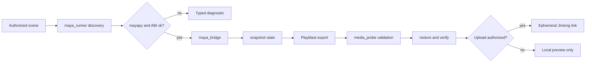

# Autodesk Maya Design Plugin


> Inspect an authorized Maya scene, capture a reversible Playblast, and return a Jimeng link through the official uploader — with the scene state restored afterwards.

[](https://github.com/full-aigc-plugins/maya-design-plugin/releases/tag/v0.1.5)
[](LICENSE)

[English](README.md) | [简体中文](README.zh-CN.md) · [Install](#installation) · [Quick start](#quick-start) · [Runtime contract](#runtime-contract) · [Troubleshooting](#troubleshooting)

## Positioning

`maya-design` inspects an authorized Autodesk Maya scene, snapshots the observable state it is about to change, produces a white-model or material-aware Playblast, validates the resulting media, and restores every value it touched. An ephemeral Jimeng link can be requested through the official uploader, and it is returned only in the response that you explicitly authorized.

The plugin is a guarded runner, not a Maya reimplementation: it discovers `mayapy`, calls it through argv, and keeps local-bridge tokens out of the stable receipts.

### Who it is for

- Technical artists who want their coding agent to prepare reviewable previews without leaving the scene changed.
- Pipeline engineers who need an argv-only, diagnosable Maya automation path.
- Reviewers who need receipts and state-restoration proof rather than a claim that a render happened.

### What problem it solves

| Problem | What this plugin provides | Verifiable entry point |
|---|---|---|
| Automation leaves scenes modified | A snapshot and restore cycle that verifies every touched field | `scripts/maya_bridge.py` |
| Maya discovery is fragile | Explicit discovery of Maya, `mayapy`, and the Python ABI | `scripts/maya_runner.py` |
| Failures are opaque | Typed diagnostics that never leak local paths | `scripts/maya_diagnostics.py` |
| Media claims are unverified | ISO BMFF parsing of the produced MP4, without ffprobe | `scripts/media_probe.py` |

## At a glance

```text
Authorized Maya scene
      │
      ▼
┌──────────────────────────────────────────────────────────┐
│ maya-design                                               │
│  ① authorize  confirm the scene and the requested scope  │
│  ② snapshot   record every value about to change         │
│  ③ playblast  camera render or existing-video link       │
│  ④ validate   parse the MP4 and check the media          │
│  ⑤ restore    put every snapshotted value back           │
│  ⑥ publish    optional Jimeng link, only on authorization│
└──────────────────────────────────────────────────────────┘
      │
      ▼
Validated Playblast media + restoration receipt
```

| Property | Value |
|---|---|
| Plugin ID | `maya-design` |
| Host | Codex CLI or ChatGPT desktop app |
| Current version | `0.1.5` |
| Plugin manifest | `.codex-plugin/plugin.json` |
| MCP configuration | none — Skills invoke `mayapy` through argv |
| Primary language | Python 3.7+ (matching Maya's embedded Python) |
| License | Apache-2.0 |

## Capabilities and boundaries

### Supported

| Capability | Input | Output | Limit | Status |
|---|---|---|---|---|
| Scene inspection | An authorized scene | Cameras, timeline, render settings, project scope | Read-only until authorized | Implemented |
| Runtime discovery | The local machine | Located `mayapy` and a validated Python ABI | Requires Maya 2022 or newer | Implemented |
| Playblast capture | A camera and timeline range | White-model or material-aware frames | Bounded by the requested range | Implemented |
| Media validation | The produced MP4 | Parsed container and codec facts | No ffprobe dependency | Implemented |
| State restoration | The snapshot | Restored values plus a confirmation | A mismatch raises an error instead of continuing | Implemented |
| Jimeng publication | An explicit upload authorization | An ephemeral link in that response only | Never stored in durable receipts | Implemented |

### Not responsible for

- Uploading to Dreamina. `dreamina-3d` owns that orchestration.
- Bundling Maya, codecs, vendor uploader source, or credentials. Vendored Python source is checksummed verbatim.
- Installing Python packages to fix a `ModuleNotFoundError`. The plugin diagnoses the failure and reports it.
- Claiming a verified live runtime. On the current verification host no Maya runtime has been authorized yet, so the real-Maya driver path remains `NOT_RUN`.

### Maturity

| Status | Meaning |
|---|---|
| Implemented | Code and offline tests exist; see the runtime note below |
| Experimental | Contract may change; verify before relying on it |
| Blocked / NOT_RUN | Not verified on this host; never present it as working |

**Runtime honesty:** the offline function-level integration and its tests exist, but real Maya discovery, real Playblast capture, the real browser hand-off, and a live marketplace install round-trip are all recorded as **not yet verified** in `docs/verification/`. Release `0.1.5` therefore retains the historical `0.1.0` implemented-but-unverified runtime evidence rather than claiming fresh live proof.

## Architecture and core flow



### Component responsibilities

| Component | Owns | Does not own |
|---|---|---|
| `scripts/maya_runner.py` | Maya and `mayapy` discovery, ABI validation, argv invocation | Scene semantics |
| `scripts/maya_bridge.py` | Inspection, Playblast, restoration, and the receipt shape | Package installation |
| `scripts/maya_diagnostics.py` | Typed, path-safe diagnostics | Fixing the environment |
| `scripts/media_probe.py` | MP4 container and codec validation | Transcoding |
| `skills/` (4) | Routing, inspection, export, and diagnosis instructions for supported hosts | Runtime enforcement |

## Compatibility

| Plugin version | Host | Maya | Python | Status |
|---|---|---|---|---|
| `0.1.0` | Codex CLI or ChatGPT desktop app | Autodesk Maya 2022 or newer with `mayapy` | 3.7 or newer, matching Maya's embedded Python | Offline tests pass; live runtime `NOT_RUN` |

Out of scope: Maya versions before 2022, and a Linux Maya installation that has no explicit `MAYA_LOCATION`.

## Installation

### Prerequisites

- Autodesk Maya 2022 or newer installed on the same machine.
- `mayapy` reachable through `MAYA_LOCATION` or on `PATH`.
- For development only: `jsonschema` from `requirements-dev.txt`.

### From the plugin marketplace

```bash
codex plugin marketplace add full-aigc-plugins/maya-design-plugin --ref v0.1.5
codex plugin add maya-design@partme-ai-maya
```

Restart Codex or the ChatGPT desktop app, then open a new task so the Skills load.

### Confirm it loaded

```bash
codex plugin list
```

Expected entry:

```text
maya-design@partme-ai-maya  installed, enabled
```

Then ask Codex to run the Maya diagnostics skill. It reports what it found, and reports a typed failure code when Maya is absent, instead of guessing.

### China mirror (AtomGit)

If GitHub is slow or unreachable, install from the AtomGit mirror instead. The
commands are identical apart from the marketplace URL:

```bash
codex plugin marketplace add https://atomgit.com/partme-ai/partme-maya-plugin.git --ref main
codex plugin add maya-design@partme-ai-maya
```

To install the whole partme-ai plugin catalog from the mirror in one step:

```bash
codex plugin marketplace add https://atomgit.com/partme-ai/plugins.git
codex plugin add maya-design@partme-ai-maya
```

Notes:

- The AtomGit source and the GitHub source share marketplace names, so adding
  one replaces the other. Switch back with
  `codex plugin marketplace add https://github.com/partme-ai/plugins.git`.
- For ZCode or Kimi, clone the mirror repository and register the local
  directory in the respective marketplace configuration.

## Quick start

### 1. Authorize a scene

Point Codex at the scene you want previewed. The plugin will not touch a scene you have not authorized.

### 2. Request a preview

```text
Inspect this Maya scene and render a white-model Playblast from the current camera over the
existing timeline range. Restore the scene when you are done. Do not upload anything yet.
```

Expected observation: cameras and render settings are listed, the snapshot is taken, the Playblast is written, the MP4 is validated, and the restoration step confirms every value went back.

### 3. Publish only if you want to

```text
Upload that validated preview and give me the Jimeng link.
```

Expected observation: the link is returned in that response only, and it is not written into any durable receipt.

## Configuration

| Setting | Where it lives | Notes |
|---|---|---|
| Maya installation | `MAYA_LOCATION` environment variable | Used when `mayapy` is not on `PATH` |
| Maya Python version | `MAYA_PYTHON_VERSION` environment variable | Read as part of ABI validation |
| Credentials | None | The plugin stores no secret; any bridge token is ephemeral |

## Runtime contract

### Stable error codes

| Code | Meaning | Source |
|---|---|---|
| `MAYA_NOT_FOUND` | No Maya installation could be discovered | `scripts/maya_runner.py` |
| `ABI_MISMATCH` | The discovered Python ABI does not match the expectation | `scripts/maya_runner.py` |
| `MODULE_LOAD_FAILED` | A required Maya module could not be imported | `scripts/maya_runner.py` |
| `MAYA_PROBE_FAILED` | The probe itself failed | `scripts/maya_runner.py` |
| `DIAGNOSTICS_FAILED` | The diagnostics pass could not complete | `scripts/maya_diagnostics.py` |
| `PATH_INVALID` | A configured path is unusable | `scripts/maya_diagnostics.py` |
| `PYTHON_NOT_FOUND` | No usable Python interpreter was found | `scripts/maya_diagnostics.py` |
| `SCENE_NOT_AUTHORIZED` | The scene was not authorized for this run | `scripts/maya_bridge.py` |
| `CAMERA_NOT_FOUND` | The requested camera does not exist | `scripts/maya_bridge.py` |
| `PLAYBLAST_FAILED` | The Playblast could not be produced | `scripts/maya_bridge.py` |
| `TIMEOUT` | The bounded operation exceeded its budget | `scripts/maya_bridge.py` |
| `RESTORE_UNCONFIRMED` | A snapshotted value did not come back | `scripts/maya_bridge.py` |
| `UPLOAD_NOT_AUTHORIZED` | Publication was requested without authorization | `scripts/maya_bridge.py` |
| `MEDIA_INVALID` | The produced media failed validation | `scripts/media_probe.py` |

### Restoration rule

Every field in the snapshot set is compared before and after the operation. A mismatch raises `RESTORE_UNCONFIRMED` rather than reporting success, so an unconfirmed restore can never be mistaken for a clean run.

## Retry, idempotency, and recovery

- The bridge keeps no persistent state; a session lives inside the `mayapy` subprocess and is gone when it exits.
- Receipts are JSON-ready and byte-stable, so the same run produces the same receipt.
- Operations are bounded by a timeout and fail with `TIMEOUT` rather than running indefinitely.
- Restoration is verified rather than assumed; the plugin prefers a loud failure over a silently modified scene.
- No operation is retried automatically.

## Data and state

| Data | Location | Lifecycle | Secrets |
|---|---|---|---|
| Bridge session | In-memory inside the `mayapy` subprocess | Until the subprocess exits | Ephemeral only |
| Playblast media | Your chosen output directory | Until you delete it | None |
| Receipt | Returned to the caller | Caller-owned | Never contains a bridge token |
| Scene state | Your Maya scene | Restored after the run | None |

## Security

- The plugin never uploads to Dreamina and never bundles the official uploader.
- Vendored vendor Python source is checksummed verbatim and is not modified.
- Local paths are kept out of diagnostics output.
- Publication requires an explicit authorization for that specific response; the link is not persisted.
- The runner uses argv-based subprocess calls with explicit project and output scopes.
- No credential is stored, and no Python package is installed at runtime.

## Development and verification

```bash
python3 -m unittest discover -s tests -v
python3 scripts/validate_distribution.py
```

Recorded evidence:

- [Offline verification](docs/verification/offline.md) — states precisely which lines are covered offline and which are not, including real Playblast capture and the real browser hand-off.
- [Maya runtime](docs/verification/maya-runtime.md) — records the blocked live-runtime state and the supported version range.
- [Getting started (中文)](docs/getting-started.zh-CN.md) — installation, authorization, and usage walkthrough.

## Troubleshooting

| Symptom | Check first | Resolution |
|---|---|---|
| `MAYA_NOT_FOUND` | Maya installation and `MAYA_LOCATION` | Install Maya 2022 or newer, or set `MAYA_LOCATION` |
| `ABI_MISMATCH` | The Maya version and its embedded Python | Point the runner at a supported Maya |
| `MODULE_LOAD_FAILED` | The Maya module path | Fix the environment; the plugin will not install packages |
| `SCENE_NOT_AUTHORIZED` | The authorization step | Authorize the scene explicitly |
| `RESTORE_UNCONFIRMED` | The reported field | Inspect the scene before continuing; do not assume it is clean |
| `MEDIA_INVALID` | The produced file | Re-run the Playblast; do not treat a parse failure as acceptable |
| Live Maya behaviour is expected | The runtime record | The live runtime is `NOT_RUN` on this host; only offline behaviour is verified |

## Project structure

```text
maya-plugin/
├── .codex-plugin/plugin.json   # identity and presentation metadata
├── .agents/plugins/marketplace.json
├── scripts/                    # bridge, runner, diagnostics, media probe, validator
├── skills/                     # 4 Skills: use, inspect, export-preview, diagnose
├── tests/                      # unit, contract, and distribution tests
├── vendor/                     # checksummed vendor Python source
└── docs/                       # architecture, technical solution, verification
```

## Deep links

- [Architecture](docs/Maya-Design-Plugin-Architecture.md) · [架构文档](docs/Maya-Design-Plugin-Architecture.zh_CN.md)
- [Technical solution](docs/Maya-Design-Plugin-Technical-Solution.md) · [技术方案](docs/Maya-Design-Plugin-Technical-Solution.zh_CN.md)
- [Design spec](docs/superpowers/specs/2026-09-11-maya-plugin-design.md)
- [Implementation plan](docs/superpowers/plans/2026-09-11-maya-plugin-implementation.md)

## Contributing and support

Open functional issues at <https://github.com/full-aigc-plugins/maya-design-plugin/issues>. Before proposing a change, state the Maya version and Python ABI you verified against, whether it alters the snapshot set or the receipt shape, and include the affected tests.

## License

Apache-2.0 — see [LICENSE](LICENSE).
