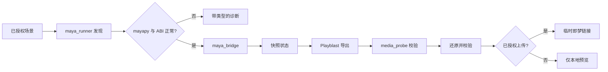

# Autodesk Maya Design 插件


> 检查已授权的 Maya 场景、抓取可恢复的 Playblast、通过官方上传器返回即梦链接——并在结束后还原场景状态。

[](https://github.com/partme-ai/partme-maya-plugin)
[](LICENSE)

[English](README.md) | [简体中文](README.zh-CN.md) · [安装](#安装) · [快速开始](#快速开始) · [运行契约](#运行契约) · [故障排查](#故障排查)

## 项目定位

`maya-design` 检查已授权的 Autodesk Maya 场景，先对即将改动的可观测状态做快照，再生成白模或材质 Playblast，校验产出的媒体，最后把它碰过的每个值都还原回去。即梦链接可以通过官方上传器按需申请，且只在你明确授权的那一次响应中返回。

插件是受控执行器，不是 Maya 的重实现：它发现 `mayapy`、用 argv 调用它，并把本地桥接 token 挡在稳定回执之外。

### 适合谁

- 希望 Codex 帮忙出可审阅预览、又不愿场景被改动的技术美术。
- 需要仅用 argv、可诊断的 Maya 自动化路径的管线工程师。
- 需要回执与"状态已还原"证据、而不是一句"渲染完了"的审阅者。

### 解决什么问题

| 问题 | 本插件提供 | 可验证入口 |
|---|---|---|
| 自动化把场景改脏 | 快照-还原循环，并逐字段校验 | `scripts/maya_bridge.py` |
| Maya 发现过程脆弱 | 显式发现 Maya、`mayapy` 与 Python ABI | `scripts/maya_runner.py` |
| 失败信息不透明 | 带类型且不泄露本地路径的诊断 | `scripts/maya_diagnostics.py` |
| 媒体结论无法核实 | 直接解析 MP4 容器（ISO BMFF），不依赖 ffprobe | `scripts/media_probe.py` |

## 一眼看懂

```text
已授权的 Maya 场景
      │
      ▼
┌──────────────────────────────────────────────────────────┐
│ maya-design                                               │
│  ① authorize  确认场景与请求范围                         │
│  ② snapshot   记录即将改动的每个值                       │
│  ③ playblast  相机渲染或已有视频链接                     │
│  ④ validate   解析 MP4 并校验媒体                        │
│  ⑤ restore    把快照中的每个值放回去                     │
│  ⑥ publish    可选的即梦链接，仅在授权时                 │
└──────────────────────────────────────────────────────────┘
      │
      ▼
经验证的 Playblast 媒体 + 还原回执
```

| 项目属性 | 值 |
|---|---|
| 插件 ID | `maya-design` |
| 宿主 | Codex CLI 或 ChatGPT 桌面应用 |
| 当前版本 | `0.1.0` |
| 插件清单 | `.codex-plugin/plugin.json` |
| MCP 配置 | 无——Skills 通过 argv 调用 `mayapy` |
| 主要语言 | Python 3.7+（与 Maya 内置 Python 对齐） |
| 许可证 | Apache-2.0 |

## 能力与边界

### 已支持

| 能力 | 输入 | 输出 | 限制 | 状态 |
|---|---|---|---|---|
| 场景检查 | 已授权的场景 | 相机、时间轴、渲染设置、工程范围 | 授权前只读 | 已实现 |
| 运行环境发现 | 本机 | 定位到的 `mayapy` 与已校验的 Python ABI | 需要 Maya 2022 或更新 | 已实现 |
| Playblast 抓取 | 一个相机与时间轴范围 | 白模或材质帧 | 受请求范围约束 | 已实现 |
| 媒体校验 | 产出的 MP4 | 解析出的容器与编码事实 | 不依赖 ffprobe | 已实现 |
| 状态还原 | 快照 | 已还原的值与确认结果 | 不一致会抛错而不是继续 | 已实现 |
| 即梦发布 | 明确的上传授权 | 仅在该响应中返回的临时链接 | 绝不写入持久回执 | 已实现 |

### 不负责

- 上传到 Dreamina。该编排由 `dreamina-3d` 负责。
- 捆绑 Maya、编码器、供应商上传器源码或凭据。vendored Python 源码按校验和原样保留。
- 为了修 `ModuleNotFoundError` 而安装 Python 包。插件只诊断并报告失败。
- 声称运行期已验证。当前验证环境尚未授权任何 Maya 运行时，因此真实 Maya 驱动路径仍为 `NOT_RUN`。

### 成熟度

| 状态 | 含义 |
|---|---|
| 已实现 | 代码与离线测试齐备；请同时阅读下方运行期说明 |
| 实验性 | 契约可能调整；依赖前请自行验证 |
| 封锁 / NOT_RUN | 本机未验证；不得描述为可用 |

**运行期诚实说明：** 离线函数级集成与其测试已经就绪，但真实 Maya 发现、真实 Playblast 抓取、真实浏览器交接，以及一次真实的 marketplace 安装往返，都已在 `docs/verification/` 中记录为**尚未验证**。请把 `0.1.0` 视为"已实现但运行期未验证"。

## 架构与核心流程



### 组件职责

| 组件 | 负责 | 不负责 |
|---|---|---|
| `scripts/maya_runner.py` | Maya 与 `mayapy` 发现、ABI 校验、argv 调用 | 场景语义 |
| `scripts/maya_bridge.py` | 检查、Playblast、还原与回执结构 | 安装依赖包 |
| `scripts/maya_diagnostics.py` | 带类型且路径安全的诊断 | 修复环境 |
| `scripts/media_probe.py` | MP4 容器与编码校验 | 转码 |
| `skills/`（4 个） | 供 Codex 使用的路由、检查、导出与诊断指令 | 运行时强制 |

## 兼容性

| 插件版本 | 宿主 | Maya | Python | 状态 |
|---|---|---|---|---|
| `0.1.0` | Codex CLI 或 ChatGPT 桌面应用 | Autodesk Maya 2022 或更新版本，且带 `mayapy` | 3.7 或更新，与 Maya 内置 Python 对齐 | 离线测试通过；实机运行 `NOT_RUN` |

范围之外：2022 之前的 Maya 版本，以及没有显式 `MAYA_LOCATION` 的 Linux Maya 安装。

## 安装

### 前置条件

- 同一台机器上安装 Autodesk Maya 2022 或更新版本。
- `mayapy` 可通过 `MAYA_LOCATION` 或 `PATH` 访问。
- 仅开发时需要：`requirements-dev.txt` 中的 `jsonschema`。

### 从插件市场安装

```bash
codex plugin marketplace add partme-ai/partme-maya-plugin --ref main
codex plugin add maya-design@partme-ai-maya
```

重启 Codex 或 ChatGPT 桌面应用，然后新建任务以加载 Skills。

### 确认加载成功

```bash
codex plugin list
```

预期条目：

```text
maya-design@partme-ai-maya  installed, enabled
```

然后让 Codex 运行 Maya 诊断 Skill。它会如实报告发现结果；Maya 缺失时返回带类型的失败码，而不是猜测。

### 国内镜像（AtomGit）

如果 GitHub 访问缓慢或不可达，可改用 AtomGit 镜像安装。命令完全一致，只把市场地址换成镜像：

```bash
codex plugin marketplace add https://atomgit.com/partme-ai/partme-maya-plugin.git --ref main
codex plugin add maya-design@partme-ai-maya
```

如需一步安装 partme-ai 全部插件目录：

```bash
codex plugin marketplace add https://atomgit.com/partme-ai/plugins.git
codex plugin add maya-design@partme-ai-maya
```

注意事项：

- AtomGit 源与 GitHub 源共用市场名，后添加的会覆盖先添加的。切回官方源执行
  `codex plugin marketplace add https://github.com/partme-ai/plugins.git`。
- ZCode 与 Kimi 用户可先将镜像仓库克隆到本地，再在各平台的 marketplace 配置中登记本地目录。

## 快速开始

### 1. 先授权场景

把要出预览的场景指给 Codex。未授权的场景，插件不会碰。

### 2. 请求预览

```text
检查这个 Maya 场景，用当前相机在现有时间轴范围内渲染白模 Playblast。
完成后还原场景。先不要上传任何东西。
```

预期观察：先列出相机与渲染设置，再拍快照，写出 Playblast，校验 MP4，最后还原步骤确认每个值都回到了原位。

### 3. 需要时才发布

```text
上传那份已验证的预览，把即梦链接给我。
```

预期观察：链接只在该响应中返回，不会写入任何持久回执。

## 配置

| 设置 | 所在位置 | 说明 |
|---|---|---|
| Maya 安装位置 | `MAYA_LOCATION` 环境变量 | 当 `mayapy` 不在 `PATH` 上时使用 |
| Maya Python 版本 | `MAYA_PYTHON_VERSION` 环境变量 | 作为 ABI 校验的一部分被读取 |
| 凭据 | 无 | 插件不保存秘密；任何桥接 token 都是临时的 |

## 运行契约

### 稳定错误码

| 错误码 | 含义 | 来源 |
|---|---|---|
| `MAYA_NOT_FOUND` | 未能发现任何 Maya 安装 | `scripts/maya_runner.py` |
| `ABI_MISMATCH` | 发现的 Python ABI 与预期不符 | `scripts/maya_runner.py` |
| `MODULE_LOAD_FAILED` | 必需的 Maya 模块无法导入 | `scripts/maya_runner.py` |
| `MAYA_PROBE_FAILED` | 探测本身失败 | `scripts/maya_runner.py` |
| `DIAGNOSTICS_FAILED` | 诊断过程无法完成 | `scripts/maya_diagnostics.py` |
| `PATH_INVALID` | 配置的路径不可用 | `scripts/maya_diagnostics.py` |
| `PYTHON_NOT_FOUND` | 未找到可用的 Python 解释器 | `scripts/maya_diagnostics.py` |
| `SCENE_NOT_AUTHORIZED` | 本次运行未获得该场景的授权 | `scripts/maya_bridge.py` |
| `CAMERA_NOT_FOUND` | 请求的相机不存在 | `scripts/maya_bridge.py` |
| `PLAYBLAST_FAILED` | 无法生成 Playblast | `scripts/maya_bridge.py` |
| `TIMEOUT` | 有界操作超出预算 | `scripts/maya_bridge.py` |
| `RESTORE_UNCONFIRMED` | 某个快照值没有还原回来 | `scripts/maya_bridge.py` |
| `UPLOAD_NOT_AUTHORIZED` | 未经授权就请求发布 | `scripts/maya_bridge.py` |
| `MEDIA_INVALID` | 产出的媒体未通过校验 | `scripts/media_probe.py` |

### 还原规则

快照集合中的每个字段都会在操作前后各比对一次。出现不一致时抛出 `RESTORE_UNCONFIRMED`，而不是报告成功——这样"还原未确认"绝不会被误当成一次干净的运行。

## 重试、幂等与恢复

- 桥接层不保留持久状态；会话存在于 `mayapy` 子进程内部，进程退出即消失。
- 回执是 JSON 就绪且字节稳定的，因此同一次运行产生同样的回执。
- 操作受超时约束，超时会以 `TIMEOUT` 失败，而不是无限期运行。
- 还原是"校验过"而不是"假定成立"；插件宁可大声失败，也不接受一个被静默改动的场景。
- 没有任何操作会被自动重试。

## 数据与状态

| 数据 | 位置 | 生命周期 | 是否含秘密 |
|---|---|---|---|
| 桥接会话 | `mayapy` 子进程的内存中 | 直到子进程退出 | 仅临时值 |
| Playblast 媒体 | 你选择的输出目录 | 直到你删除 | 否 |
| 回执 | 返回给调用方 | 由调用方持有 | 绝不含桥接 token |
| 场景状态 | 你的 Maya 场景 | 运行结束后被还原 | 否 |

## 安全

- 插件绝不上传到 Dreamina，也绝不捆绑官方上传器。
- vendored 的供应商 Python 源码按校验和原样保留，不做修改。
- 诊断输出中不包含本地路径。
- 发布需要针对该次响应明确授权；链接不会被持久化。
- 运行器使用 argv 式子进程调用，并限定明确的工程与输出范围。
- 不存储任何凭据，也不在运行期安装任何 Python 包。

## 开发与验证

```bash
python3 -m unittest discover -s tests -v
python3 scripts/validate_distribution.py
```

仓库中已记录的证据：

- [离线验证](docs/verification/offline.md)——精确说明哪些条目已被离线覆盖、哪些没有，包括真实 Playblast 抓取与真实浏览器交接。
- [Maya 运行期](docs/verification/maya-runtime.md)——记录被阻塞的实机运行状态与受支持版本范围。
- [安装与使用（中文）](docs/getting-started.zh-CN.md)——安装、授权与使用流程。

## 故障排查

| 现象 | 优先检查 | 处理方式 |
|---|---|---|
| `MAYA_NOT_FOUND` | Maya 安装与 `MAYA_LOCATION` | 安装 Maya 2022 或更新版本，或设置 `MAYA_LOCATION` |
| `ABI_MISMATCH` | Maya 版本与其内置 Python | 把运行器指向受支持的 Maya |
| `MODULE_LOAD_FAILED` | Maya 模块路径 | 修正环境；插件不会安装依赖包 |
| `SCENE_NOT_AUTHORIZED` | 授权步骤 | 显式授权该场景 |
| `RESTORE_UNCONFIRMED` | 被报告的字段 | 先检查场景再继续；不要假定它是干净的 |
| `MEDIA_INVALID` | 产出的文件 | 重跑 Playblast；解析失败不能被当作可接受 |
| 期望 Maya 实机行为 | 运行期记录 | 本机实机运行为 `NOT_RUN`；只有离线行为已被验证 |

## 项目结构

```text
maya-plugin/
├── .codex-plugin/plugin.json   # 身份与展示元数据
├── .agents/plugins/marketplace.json
├── scripts/                    # 桥接、运行器、诊断、媒体探测、校验器
├── skills/                     # 4 个 Skill：use、inspect、export-preview、diagnose
├── tests/                      # 单元、契约与分发测试
├── vendor/                     # 带校验和的供应商 Python 源码
└── docs/                       # 架构、技术方案、验证记录
```

## 深入文档

- [Architecture](docs/Maya-Design-Plugin-Architecture.md) · [架构文档](docs/Maya-Design-Plugin-Architecture.zh_CN.md)
- [Technical solution](docs/Maya-Design-Plugin-Technical-Solution.md) · [技术方案](docs/Maya-Design-Plugin-Technical-Solution.zh_CN.md)
- [设计规格](docs/superpowers/specs/2026-09-11-maya-plugin-design.md)
- [实施计划](docs/superpowers/plans/2026-09-11-maya-plugin-implementation.md)

## 贡献与支持

功能问题请提交到 <https://github.com/partme-ai/partme-maya-plugin/issues>。提交变更前，请说明你验证所用的 Maya 版本与 Python ABI、是否改动快照集合或回执结构，并附上受影响的测试。

## 许可证

Apache-2.0，见 [LICENSE](LICENSE)。
