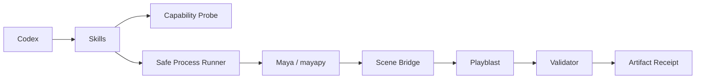
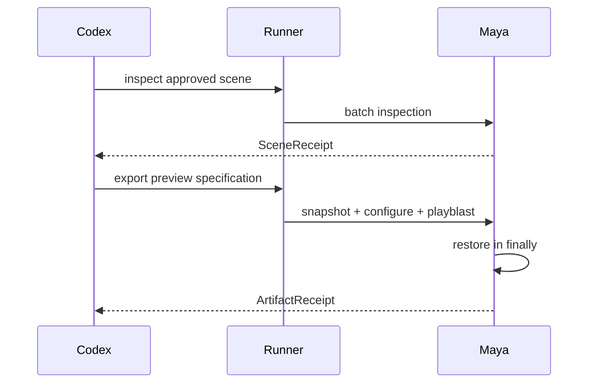

# Codex Maya Plugin Architecture

> Target architecture; not implemented. Version 0.1 design, 2026-09-11.

## 1. Drivers

Maya automation must tolerate version-specific Python runtimes, module paths, UI/batch differences, and scene mutations. The plugin provides reversible local preview export, not creative cloud generation.

## 2. Context and components

| Component | Responsibility |
|---|---|
| Probe | executable, version, Python ABI, module/plugin paths |
| Runner | argv, environment allowlist, timeout, cancellation |
| Scene bridge | cameras, timeline, materials, render/playblast settings |
| State snapshot | exact pre-change values and restoration |
| Validator | H.264/media properties and SHA-256 receipt |

## 3. Runtime flow

## 4. Trust and failure boundaries

Scene scripts, modules, references, callbacks, and plug-ins are untrusted until explicitly authorized. Errors are normalized; raw environment values and private paths are not logged. Render or upload actions are never automatically retried.

## 5. Interoperability

The output receipt matches the media handoff contract used by `codex-blender` and consumed by `codex-dreamina-3d`. Maya-specific details never leak into the Dreamina orchestration contract.

## 6. Compatibility

The design anticipates Maya 2022+ differences but makes no support claim. Each supported OS/Maya/Python combination requires a recorded runtime test.
