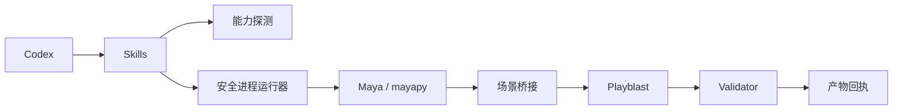
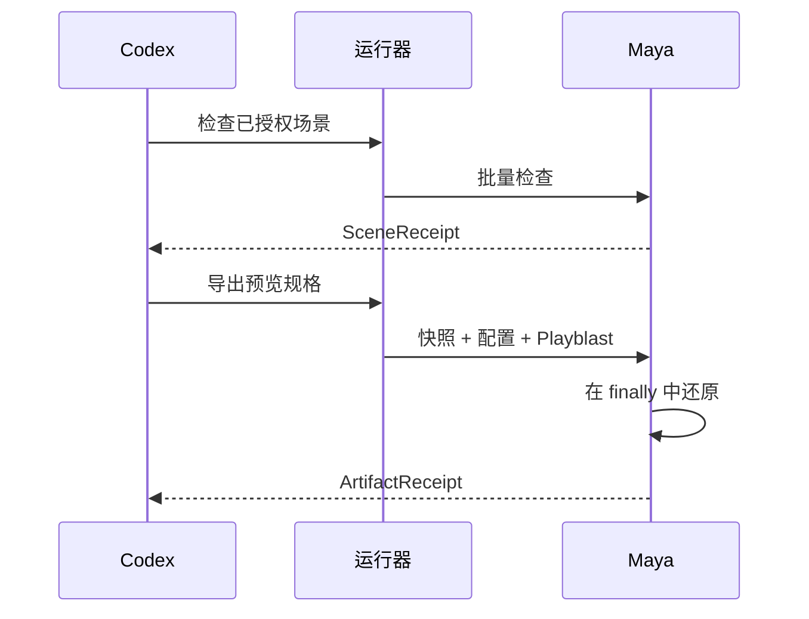

# Codex Maya 插件架构

> **文档信息**
>
> | 字段 | 值 |
> |---|---|
> | 状态 | 离线函数级集成已实现；真实 Maya 运行尚未验证 |
> | 范围 | 本插件如何产出可恢复、已校验的 Maya 预览与可选的即梦链接 |
> | 读者 | 技术美术、管线工程师与审阅者 |
> | 不在范围 | 云端生成、上传编排、DCC 许可与编码器许可 |
> | 运行证据 | `docs/verification/` |
> | 最近一次结构修订 | 2026-09-14 |

## 1. 执行摘要

`codex-maya` 检查已授权的 Autodesk Maya 场景，对即将改动的每个值做快照，生成白模或材质 Playblast，不依赖外部探测工具直接校验产出的媒体，最后把它碰过的东西还原回去。即梦链接可通过官方上传器申请，且只在用户明确授权的那一次响应中返回。

插件是受控执行器：发现 `mayapy`、用 argv 调用它，并把桥接 token 挡在稳定回执之外。它不上传到 Dreamina；该编排由 `codex-dreamina-3d` 负责。

### 实现诚实度

| 界面 | 状态 |
|---|---|
| 运行器、桥接、诊断、媒体探测、还原循环、回执 | 已实现，并有离线测试覆盖 |
| 真实 Maya 发现、真实 Playblast 抓取、真实浏览器交接 | 本机未验证 |
| 真实的 marketplace 安装往返 | 未验证 |
| 上传编排与云端生成 | 不属于本插件 |

## 2. 驱动力与约束

| 驱动力 | 对架构的后果 |
|---|---|
| Maya 自动化必须容忍版本相关的 Python 运行时与模块路径 | 运行时发现是显式且有类型的，绝不假定 |
| 场景改动若不回滚就是破坏性操作 | 每个被碰过的字段都做快照，并在还原时校验 |
| 还原失败比渲染失败更糟 | 还原未确认时抛错，而不是报告成功 |
| 诊断往往要解释一个坏掉的环境 | 诊断带类型且路径安全，并且绝不安装依赖包 |
| 媒体校验不能依赖未经验证的外部工具 | MP4 容器在进程内解析 |

### 非目标

- 上传到 Dreamina，或复制供应商上传器。
- 捆绑 Maya、编码器、供应商源码或凭据。
- 为修复坏掉的 Maya 环境而安装 Python 包。
- 在本机尚未授权任何 Maya 运行时的情况下声称实机已验证。

## 3. 上下文与信任边界



| 边界 | 内部 | 外部 |
|---|---|---|
| 本插件 | 探测、运行器、场景桥接、快照与还原、媒体校验 | 上传与云端生成 |
| Maya | 场景数据、渲染与播放状态、`mayapy` | 通过 argv 与环境变量白名单调用 |
| 上传器 | 浏览器交接与链接创建 | 由用户安装；绝不捆绑 |

| 组件 | 职责 |
|---|---|
| 探测 | 可执行文件、版本、Python ABI、模块与插件路径 |
| 运行器 | argv、环境白名单、超时、取消 |
| 场景桥接 | 相机、时间轴、材质、渲染与 Playblast 设置 |
| 状态快照 | 改动前的确切值与还原 |
| 校验器 | H.264/媒体属性与 SHA-256 回执 |

## 4. 当前状态、目标状态与差距

| 能力 | 当前 | 目标 | 差距 |
|---|---|---|---|
| 场景检查 | 已实现 | 不变 | 无 |
| 运行时发现 | 已实现，含带类型的失败路径 | 不变 | 正常路径的发现只在装有 Maya 的机器上验证过 |
| Playblast 抓取 | 已按 Maya API 实现 | 不变 | 本机未验证真实抓取 |
| 媒体校验 | 进程内已实现 | 不变 | 无 |
| 状态还原 | 已实现，并针对快照集合校验 | 不变 | 无 |
| 即梦发布 | 已按用户启用的上传器实现 | 用户安装后即可用 | 受外部条件限制 |
| 真实安装往返 | 未验证 | 已验证 | 需要一次 marketplace 往返 |

## 5. 原则与决策

| 决策 | 理由 | 反转条件 |
|---|---|---|
| 快照并校验，而不是尽力还原 | 被静默改动的场景等于数据丢失 | 无 |
| 在进程内解析 MP4 | 依赖未经验证的外部探测会让媒体结论无法核实 | 若出现平台背书的探测工具 |
| 只诊断，不安装 | 改动用户的 Maya 环境不在范围内 | 用户明确要求执行修复动作 |
| 上传不放进本插件 | `codex-dreamina-3d` 已经拥有该编排 | 无 |
| 链接只在被授权的响应中返回 | 持久回执绝不应携带有效桥接 token | 无 |

## 6. 组件与依赖

| 组件 | 负责 | 不负责 |
|---|---|---|
| `scripts/maya_runner.py` | Maya 与 `mayapy` 发现、ABI 校验、argv 调用 | 场景语义 |
| `scripts/maya_bridge.py` | 检查、Playblast、还原与回执结构 | 安装依赖包 |
| `scripts/maya_diagnostics.py` | 带类型且路径安全的诊断 | 修复环境 |
| `scripts/media_probe.py` | MP4 容器与编码校验 | 转码 |
| `skills/`（4 个） | 路由、检查、导出与诊断指令 | 运行时强制 |

依赖方向是单向的：Skills 调用运行器，运行器在 `mayapy` 内启动桥接，桥接把回执向上报告。没有任何组件反向进入 Codex。

## 7. 运行期与核心流程

### 7.1 主流程



### 7.2 失败与恢复语义

| 失败 | 检测方式 | 行为 | 恢复 |
|---|---|---|---|
| 找不到 Maya | 发现阶段 | 带类型的 `MAYA_NOT_FOUND`；不产生任何改动 | 安装 Maya 或设置其位置 |
| Python ABI 不匹配 | ABI 校验 | 带类型的 `ABI_MISMATCH` | 把运行器指向受支持的 Maya |
| 模块导入失败 | 桥接启动 | 带类型的 `MODULE_LOAD_FAILED` | 修正环境；不会安装任何包 |
| 场景未授权 | 授权检查 | 带类型的 `SCENE_NOT_AUTHORIZED` | 显式授权该场景 |
| Playblast 失败 | 导出步骤 | 带类型的 `PLAYBLAST_FAILED` | 重新导出 |
| 操作超出预算 | 超时 | 带类型的 `TIMEOUT`；不会无限运行 | 有意识地下次重试 |
| 还原不匹配 | 快照比对 | 带类型的 `RESTORE_UNCONFIRMED` | 先检查场景再继续 |
| 媒体非法 | 进程内解析 | 带类型的 `MEDIA_INVALID` | 重跑 Playblast |
| 未经授权请求上传 | 授权检查 | 带类型的 `UPLOAD_NOT_AUTHORIZED` | 显式授权发布 |

渲染或上传动作绝不自动重试。

## 8. 状态、数据与协议

| 数据 | 所有者 | 位置 | 一致性 |
|---|---|---|---|
| 桥接会话 | 本插件 | `mayapy` 子进程的内存中 | 子进程退出即消失 |
| 场景快照 | 场景桥接 | 操作期间驻留内存 | 前后逐字段比对 |
| Playblast 媒体 | 调用方 | 选定的输出目录 | 同一次运行的回执字节稳定 |
| 回执 | 本插件 | 返回给调用方 | 不含任何桥接 token |

没有持久状态，也没有数据库。回执就是全部持久契约。

## 9. 安全

- 场景脚本、模块、引用、回调与插件在被显式授权前都是不可信输入。
- 错误被归一化；原始环境值与私有路径不会被记录。
- 运行器对参数与环境变量都使用 argv 白名单。
- 供应商 Python 源码按校验和原样 vendoring，不做修改。
- 发布后返回的链接是临时的，绝不写入回执。
- 不存储任何凭据，运行时也不安装任何包。

## 10. 资源与运行预算

| 预算 | 值 | 理由 |
|---|---|---|
| 操作时长 | 有界，并带类型化超时 | 坏掉的环境会让 Maya 批处理挂住 |
| 还原校验 | 每个快照字段 | 部分还原不可接受 |
| 诊断输出 | 路径安全且有界 | 诊断会被分享，不能泄露本机布局 |
| 重试 | 不自动重试 | 重试无法修复坏掉的环境 |

### 运行

```bash
python3 -m unittest discover -s tests -v
python3 scripts/validate_distribution.py
```

### 互操作性

产出的回执与 `codex-blender` 使用的媒体交接契约一致，并由 `codex-dreamina-3d` 消费。Maya 特有的细节绝不泄漏进 Dreamina 编排契约。

## 11. 部署、兼容性与演进

| 方面 | 立场 |
|---|---|
| 分发 | 指向本仓库、固定到 `main` 的 Codex marketplace 条目 |
| Python | 3.7 或更新，与 Maya 内置解释器对齐 |
| Maya | 2022 或更新；每个受支持的 OS/Maya/Python 组合都需要一次记录的运行测试 |
| 范围之外 | 2022 之前的 Maya，以及没有显式 `MAYA_LOCATION` 的 Linux 安装 |
| 回滚 | 回退插件即可；它不保留需要迁移的持久状态 |

| 风险 | 缓解 |
|---|---|
| 实机行为未验证 | 运行记录逐条写明已验证与未验证的内容 |
| 环境漂移 | 用带类型的诊断，而不是静默修复 |
| 与兄弟插件的契约漂移 | 回执遵循共享的媒体交接契约 |

## 12. 证据映射

| 断言 | 证据 |
|---|---|
| 发现与 ABI 校验 | `scripts/maya_runner.py` |
| 快照与还原校验 | `scripts/maya_bridge.py` |
| 媒体校验 | `scripts/media_probe.py` |
| 诊断 | `scripts/maya_diagnostics.py` |
| 离线范围 | `docs/verification/offline.md` |
| 运行状态 | `docs/verification/maya-runtime.md` |
