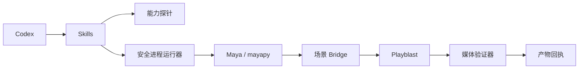
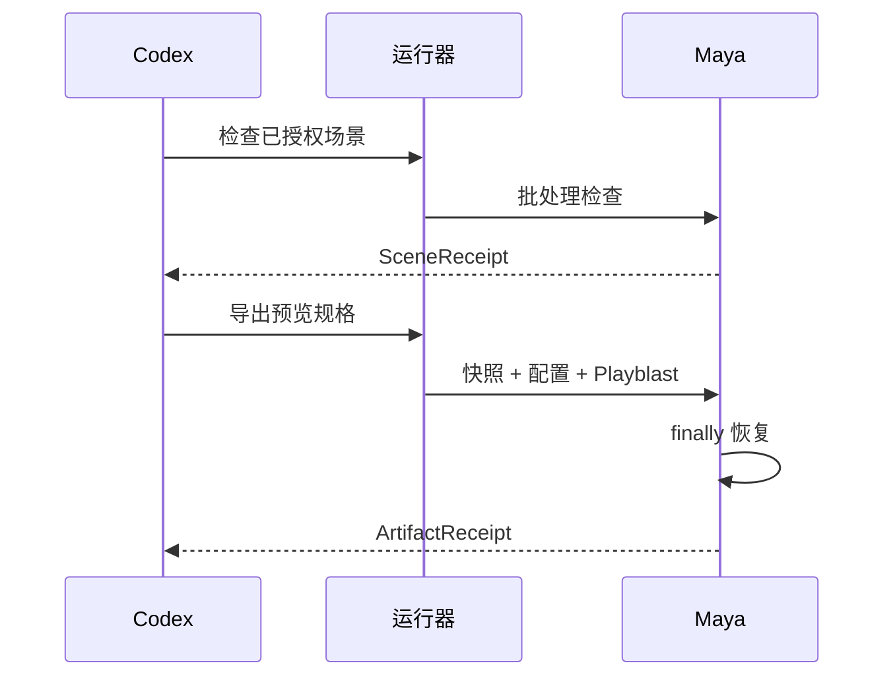

# Codex Maya 插件架构

> 目标架构，尚未实现。0.1 设计稿，2026-09-11。

## 1. 架构驱动

Maya 自动化必须处理不同版本 Python Runtime、模块路径、UI/批处理差异和场景状态修改。插件只负责可恢复的本地预览导出，不负责云端创作生成。

## 2. 上下文与组件

| 组件 | 职责 |
|---|---|
| 能力探针 | 可执行文件、版本、Python ABI、模块和插件路径 |
| 运行器 | argv、环境变量白名单、超时和取消 |
| 场景 Bridge | 相机、时间轴、材质、渲染和 Playblast 设置 |
| 状态快照 | 修改前精确值和恢复 |
| 验证器 | H.264/媒体属性与 SHA-256 回执 |

## 3. 运行流程

## 4. 信任与故障边界

场景脚本、模块、引用、回调和插件默认不可信，只有用户明确授权后才运行。错误需要稳定映射，不记录完整环境值和私有路径。渲染或上传不得自动重试。

## 5. 联动契约

输出回执与 `codex-blender` 一致，由 `codex-dreamina-3d` 消费；Maya 细节不得泄漏到 Dreamina 编排契约。

## 6. 兼容性

设计考虑 Maya 2022+ 差异，但不作支持声明。每个 OS/Maya/Python 组合都需要实际运行证据。
