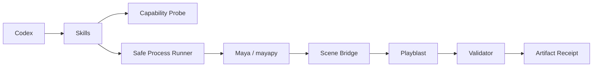
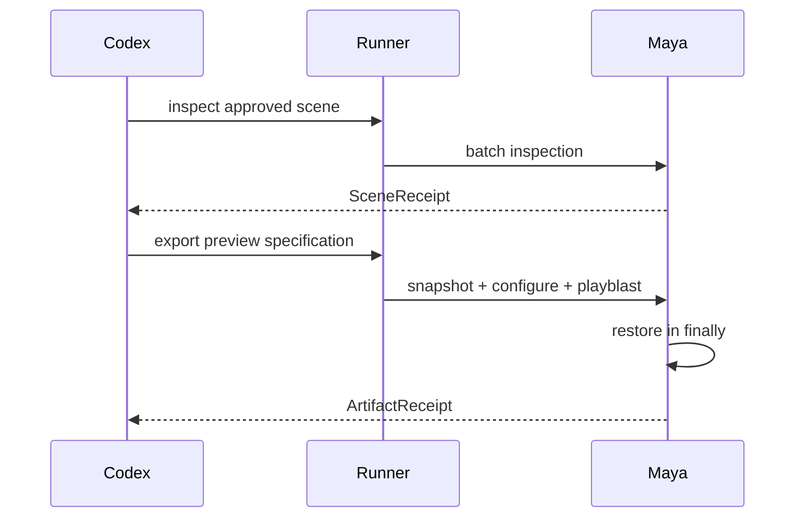

# Autodesk Maya Design Plugin Architecture

> **Document control**
>
> | Field | Value |
> |---|---|
> | Status | Offline function-level integration implemented; real-Maya runtime not verified |
> | Scope | How this plugin produces a reversible, validated Maya preview and an optional Jimeng link |
> | Audience | Technical artists, pipeline engineers, and reviewers |
> | Out of scope | Cloud generation, upload orchestration, DCC licensing, and codec licensing |
> | Runtime evidence | `docs/verification/` |
> | Last structural revision | 2026-09-14 |

## 1. Executive summary

`maya-design` inspects an authorized Autodesk Maya scene, snapshots every value it is about to change, produces a white-model or material-aware Playblast, validates the resulting media without an external probe, and restores what it touched. A Jimeng link can be requested through the official uploader, and it is returned only in the response the user explicitly authorized.

The plugin is a guarded runner: it discovers `mayapy`, invokes it through argv, and keeps bridge tokens out of stable receipts. It does not upload to Dreamina; `dreamina-3d` owns that orchestration.

### Implementation honesty

| Surface | State |
|---|---|
| Runner, bridge, diagnostics, media probe, restore cycle, receipts | Implemented and covered by offline tests |
| Real Maya discovery, real Playblast capture, real browser hand-off | Not verified on this host |
| Live marketplace install round-trip | Not verified |
| Upload orchestration and cloud generation | Not owned here |

## 2. Drivers and constraints

| Driver | Consequence for the architecture |
|---|---|
| Maya automation must tolerate version-specific Python runtimes and module paths | Runtime discovery is explicit and typed, never assumed |
| Scene mutations are destructive if not reversed | Every touched field is snapshotted and verified on restore |
| A failed restore is worse than a failed render | An unconfirmed restore raises an error instead of reporting success |
| Diagnostics often need to explain a broken environment | Diagnostics are typed and path-safe, and never install packages |
| Media validation must not depend on an unverified external tool | The MP4 container is parsed in-process |

### Non-goals

- Uploading to Dreamina or replicating the vendor uploader.
- Bundling Maya, codecs, vendor source, or credentials.
- Installing Python packages to repair a broken Maya environment.
- Claiming a verified live runtime while no Maya runtime has been authorized on this host.

## 3. Context and trust boundary



| Boundary | Inside | Outside |
|---|---|---|
| This plugin | Probe, runner, scene bridge, snapshot and restore, media validation | Upload and cloud generation |
| Maya | Scene data, render and playback state, `mayapy` | Invoked through argv with an environment allowlist |
| The uploader | Browser hand-off and link creation | User-installed; never bundled |

| Component | Responsibility |
|---|---|
| Probe | executable, version, Python ABI, module/plugin paths |
| Runner | argv, environment allowlist, timeout, cancellation |
| Scene bridge | cameras, timeline, materials, render/playblast settings |
| State snapshot | exact pre-change values and restoration |
| Validator | H.264/media properties and SHA-256 receipt |

## 4. Current state, target state, and gaps

| Capability | Current | Target | Gap |
|---|---|---|---|
| Scene inspection | Implemented | Unchanged | None |
| Runtime discovery | Implemented, including typed failure paths | Unchanged | Happy-path discovery is verified only on a machine that has Maya |
| Playblast capture | Implemented against the Maya API | Unchanged | Real capture not verified on this host |
| Media validation | Implemented in-process | Unchanged | None |
| State restoration | Implemented and verified against the snapshot set | Unchanged | None |
| Jimeng publication | Implemented against a user-enabled uploader | Available once the user installs it | Externally gated |
| Live install round-trip | Not verified | Verified | Requires a marketplace round-trip |

## 5. Principles and decisions

| Decision | Rationale | Reversal condition |
|---|---|---|
| Snapshot and verify instead of best-effort restore | A silently modified scene is a data-loss event | None |
| Parse the MP4 in-process | An unverified external probe would make the media claim unverifiable | If a platform-blessed probe becomes available |
| Diagnose without installing | Mutating the user's Maya environment is out of scope | An explicit user request for a repair action |
| Keep upload out of this plugin | `dreamina-3d` already owns orchestration | None |
| Return the link only in the authorized response | A durable receipt must never carry a live bridge token | None |

## 6. Components and dependencies

| Component | Owns | Does not own |
|---|---|---|
| `scripts/maya_runner.py` | Maya and `mayapy` discovery, ABI validation, argv invocation | Scene semantics |
| `scripts/maya_bridge.py` | Inspection, Playblast, restoration, receipt shape | Package installation |
| `scripts/maya_diagnostics.py` | Typed, path-safe diagnostics | Repairing the environment |
| `scripts/media_probe.py` | MP4 container and codec validation | Transcoding |
| `skills/` (4) | Routing, inspection, export, and diagnosis instructions | Runtime enforcement |

Dependency direction is one-way: Skills call the runner, the runner starts the bridge inside `mayapy`, and the bridge reports a receipt upward. Nothing reaches back into Codex.

## 7. Runtime and core flows

### 7.1 Primary flow



### 7.2 Failure and recovery semantics

| Failure | Detection | Behavior | Recovery |
|---|---|---|---|
| Maya missing | Discovery | Typed `MAYA_NOT_FOUND`; nothing is mutated | Install Maya or set its location |
| Python ABI mismatch | ABI validation | Typed `ABI_MISMATCH` | Point the runner at a supported Maya |
| Module import failure | Bridge start | Typed `MODULE_LOAD_FAILED` | Fix the environment; no package is installed |
| Scene not authorized | Authorization check | Typed `SCENE_NOT_AUTHORIZED` | Authorize the scene explicitly |
| Playblast failure | Export step | Typed `PLAYBLAST_FAILED` | Re-run the export |
| Operation exceeds its budget | Timeout | Typed `TIMEOUT`; no indefinite run | Retry deliberately |
| Restore mismatch | Snapshot comparison | Typed `RESTORE_UNCONFIRMED` | Inspect the scene before continuing |
| Media invalid | In-process parse | Typed `MEDIA_INVALID` | Re-run the Playblast |
| Upload requested without authorization | Authorization check | Typed `UPLOAD_NOT_AUTHORIZED` | Authorize the publication explicitly |

Render or upload actions are never automatically retried.

## 8. State, data, and protocol

| Data | Owner | Location | Consistency |
|---|---|---|---|
| Bridge session | This plugin | In memory inside the `mayapy` subprocess | Gone when the subprocess exits |
| Scene snapshot | Scene bridge | In memory for the operation | Compared field by field before and after |
| Playblast media | Caller | The chosen output directory | The receipt is byte-stable for the same run |
| Receipt | This plugin | Returned to the caller | Contains no bridge token |

There is no persistent state and no database. The receipt is the entire durable contract.

## 9. Security

- Scene scripts, modules, references, callbacks, and plug-ins are untrusted until explicitly authorized.
- Errors are normalized; raw environment values and private paths are not logged.
- The runner uses an argv allowlist for both arguments and environment variables.
- Vendor Python source is vendored verbatim and checksummed; it is not modified.
- The link returned after publication is ephemeral and never written into a receipt.
- No credential is stored, and no package is installed at runtime.

## 10. Resource and operational budgets

| Budget | Value | Rationale |
|---|---|---|
| Operation time | Bounded, with a typed timeout | Maya batch work can hang on a broken environment |
| Restore verification | Every snapshotted field | Partial restoration is not acceptable |
| Diagnostics output | Path-safe and bounded | Diagnostics get shared; they must not leak the local layout |
| Retries | None automatic | A retry cannot repair a broken environment |

### Operations

```bash
python3 -m unittest discover -s tests -v
python3 scripts/validate_distribution.py
```

### Interoperability

The output receipt matches the media handoff contract used by `blender-design` and consumed by `dreamina-3d`. Maya-specific details never leak into the Dreamina orchestration contract.

## 11. Deployment, compatibility, and evolution

| Aspect | Position |
|---|---|
| Distribution | Codex marketplace entry pointing at this repository, pinned to `main` |
| Python | 3.7 or newer, matching Maya's embedded interpreter |
| Maya | 2022 or newer; each supported OS/Maya/Python combination needs a recorded runtime test |
| Out of scope | Maya before 2022, and a Linux install with no explicit `MAYA_LOCATION` |
| Rollback | Revert the plugin; it keeps no persistent state to migrate |

| Risk | Mitigation |
|---|---|
| Unverified live behavior | The runtime record states exactly what is and is not verified |
| Environment drift | Typed diagnostics rather than silent repair |
| Contract drift with siblings | The receipt matches the shared media handoff contract |

## 12. Evidence map

| Claim | Evidence |
|---|---|
| Discovery and ABI validation | `scripts/maya_runner.py` |
| Snapshot and restore verification | `scripts/maya_bridge.py` |
| Media validation | `scripts/media_probe.py` |
| Diagnostics | `scripts/maya_diagnostics.py` |
| Offline scope | `docs/verification/offline.md` |
| Runtime status | `docs/verification/maya-runtime.md` |
