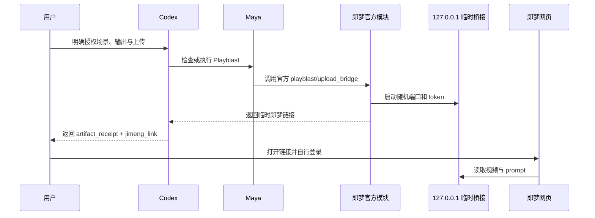

# Codex Maya 安装、授权与使用指南

<p align="center"></p>

## 快速开始

### 第 1 步：安装 Autodesk Maya

> ## [👉 Autodesk Maya 官方下载与试用](https://www.autodesk.com/products/maya/free-trial)
>
> Maya 是商业软件，需要 Autodesk 账号和有效试用、教育或订阅许可。

选择操作系统、Maya 版本和语言后完成安装，至少使用 Maya 2022。安装后手工启动一次，
完成 Autodesk 登录和许可激活，并确认能看到默认 Maya 工作区。

常见 macOS 安装根目录：

```text
/Applications/Autodesk/maya2026
```

常见 Windows 安装根目录：

```text
C:\Program Files\Autodesk\Maya2026
```

系统要求请查看 [Autodesk Maya 系统要求](https://www.autodesk.com/support/technical/article/caas/sfdcarticles/sfdcarticles/System-requirements-for-Autodesk-Maya.html)。

### 第 2 步：安装 Codex 插件

```bash
codex plugin marketplace add https://github.com/partme-ai/partme-maya-plugin.git --ref main
codex plugin add codex-maya@partme-ai-maya
codex plugin list --available --json
```

看到 `codex-maya` 后新建一个 Codex 任务。使用 Codex 流程时，不需要另行运行即梦官方
`install_maya_plugin.command/.bat`；官方 Python 模块已在本插件中按校验和原样 vendoring。

### 第 3 步：准备场景

1. 准备一个已保存的 `.ma` 或 `.mb` 文件。
2. 确认场景至少有一台可用相机和可见 Model Panel。
3. 帧范围至少 44 帧、最多 720 帧。
4. 准备并授权一个输出目录。
5. 确认 ffmpeg/ffprobe 可用。

### 第 4 步：先检查，再渲染

```text
先只读检查 /path/to/scene.ma，列出相机、帧范围、分辨率、材质和未知插件，不要渲染。
Maya 根目录是 /Applications/Autodesk/maya2026。
```

确认后发送：

```text
我授权使用 camera1 渲染 1-120 帧到 /path/to/output，并生成一次即梦链接；失败不要重试。
```

### 第 5 步：打开即梦链接



插件不会代替用户登录即梦，也不会自动确认付费生成。浏览器未登录时按即梦网页提示
登录；浏览器询问是否允许网页访问本地网络时，由用户确认本次访问。

## 已有视频生成链接

支持 `.mp4`、`.mov`、`.webm`、`.avi`。明确告诉 Codex：

```text
我授权使用 /path/to/preview.mov 生成一次即梦链接，不要执行 Maya Playblast。
```

该模式直接复用官方 `upload_bridge.start_local_bridge()`；非 MP4 文件由官方 ffmpeg
路径转换，回执会指向桥接实际提供的 MP4，而不是错误地指向原始文件。

## 授权边界

| 授权 | 含义 |
|---|---|
| 场景授权 | 允许 Codex 读取指定 `.ma/.mb`，不代表可运行场景内任意脚本 |
| 输出授权 | 允许在指定目录创建 Playblast/MP4 |
| 上传授权 | 必须显式 `authorize_upload=true` 才会启动本地桥接和生成链接 |
| Maya 许可 | 由 Autodesk 管理，与 Codex 插件授权不同 |
| 即梦登录 | 由即梦网页管理，插件不保存账号、Cookie 或密码 |

链接 token 不写入稳定 artifact receipt，只在本次 `jimeng_link` 响应中出现。桥接监听
`127.0.0.1`，默认约 30 分钟过期，视频被读取后会自动关闭。

## 当前运行限制

- 离线函数和 fake `maya.cmds` 测试已覆盖官方模块复用，但不能替代真实 Maya 验收。
- 当前命令行入口仍是 stub，尚未完成 Codex 到真实 Maya GUI/Model Panel 的驱动通道。
- Playblast 依赖可见 Model Panel；不能假设普通 mayapy 无界面进程一定可用。
- 当前机器未发现获授权的 Maya/mayapy，因此 runtime matrix 仍为 Blocked。
